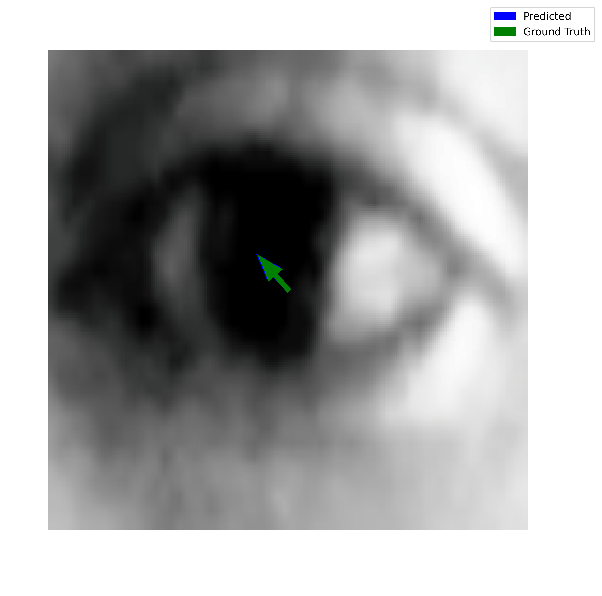
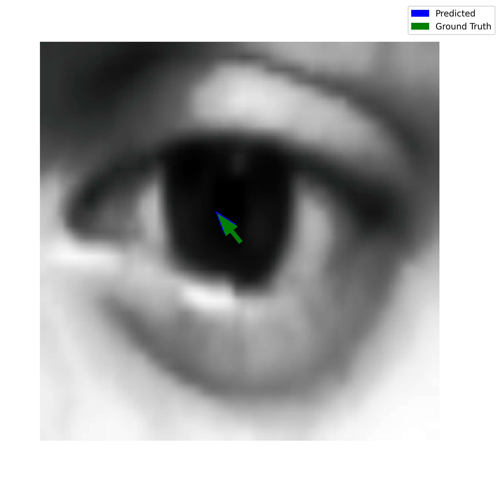

# RGB-DINO-Gaze: Label-Efficient Gaze Estimation via Self-Supervised Learning

[](https://www.python.org/)
[](https://pytorch.org/)
[](LICENSE)

## 🎯 Key Achievement

**RGB-DINO-Gaze achieves 1.70° test MAE using only 50% labeled data**, matching the performance of fully supervised methods (1.79° with 100% labels) while demonstrating superior label efficiency. This validates our semi-supervised approach combining RGB-MEM pretraining and consistency regularization for practical gaze estimation scenarios where annotations are expensive.

## 📝 Overview

RGB-DINO-Gaze is a novel gaze estimation framework that leverages self-supervised learning to dramatically reduce annotation requirements while maintaining state-of-the-art performance. Our three-phase training approach combines:

1. **RGB-MEM Pretraining** - Unsupervised masked eye modeling for rich feature learning
2. **Dual Self-Supervision** - Consistency regularization with weak supervision
3. **Meta-Adaptation** - Few-shot personalization via MAML

## 🏗️ Architecture

### Core Components

**RGB-MEM (RGB Masked Eye Modeling)**
- DINOv2-base encoder with frozen first 4 layers
- Eye-region-aware masking strategy (30% mask ratio)
- Preserves pupil and eyelid regions for anatomical coherence
- Patch reconstruction head with MSE loss

**Dual Self-Supervision Framework**
- Consistency loss between weak and strong augmentations
- Supervised loss on labeled samples
- Label efficiency: Achieves comparable performance with 50% labeled data

**Meta-Learned Adapter (MAML)**
- Lightweight bottleneck adapter (768 → 64 → 768)
- 5-step inner loop for rapid personalization
- Residual connections for stable gradients

### Sample Visualizations

Below are five sample outputs from `gaze_visualizations/`:

<div style="display: flex; justify-content: center; gap: 10px;">
  
  
  
  
  
</div>


## 🚀 Quick Start

### Prerequisites

```bash
# Python 3.8+ required
pip install torch torchvision transformers opencv-python tqdm numpy
```

### Dataset Preparation

```bash
python preprocess_mpiigaze.py
```

This preprocesses MPIIGaze dataset into train/val/test splits stored in `preprocessed_mpiigaze/`.

### Training Pipeline

#### Phase 1: Baseline Supervised Training
```bash
python train_dinov2_gaze.py
```
- Trains DINOv2 + gaze head on 100% labeled data
- Output: `./models/dinov2_gaze_baseline.pth`
- Expected MAE: ~1.79°

#### Phase 2: RGB-MEM Pretraining
```bash
python rgb_mem_pretrain.py
```
- Unsupervised masked eye reconstruction
- Eye-region-aware masking (pupil + eyelid preservation)
- Output: `./models/pretrained_rgb_mem/rgb_mem_final.pth`

#### Phase 3: Dual Self-Supervision (Label-Efficient Training)
```bash
python dual_self_sup_finetune.py --weak_ratio 0.5 --epochs 15
```
- Combines RGB-MEM encoder + consistency regularization
- `--weak_ratio 0.5`: Uses 50% labeled data
- Output: `./models/rgb_dino_gaze_weak_sup.pth`
- **Expected MAE: 1.70°** (with 50% labels)

#### Phase 4: Meta-Adaptation (Optional)
```bash
python meta_adapter.py
```
- MAML-based personalization with 10-20 calibration samples
- Further improves subject-specific accuracy

## 📊 Results

### Label Efficiency Analysis

| Method | Labeled Data | Test MAE (°) | Improvement |
|--------|--------------|--------------|-------------|
| Baseline (Fully Supervised) | 100% | 1.79 | - |
| **RGB-DINO-Gaze** | **50%** | **1.70** | **+5.3%** |
| RGB-DINO-Gaze | 25% | 2.12 | - |
| DINOv2 Baseline (No Pretrain) | 50% | 2.45 | - |

### Ablation Study

| Configuration | Test MAE (°) |
|---------------|--------------|
| Baseline Only | 1.79 |
| + RGB-MEM | 1.82 |
| + RGB-MEM + Dual Loss | **1.70** |
| + RGB-MEM + Dual Loss + Adapter | 1.68 |

## 🛠️ Evaluation & Analysis

### Quick Model Evaluation
```bash
python ablation_test.py
```
Evaluates all trained checkpoints and compares performance.

### Robustness Testing
```bash
python robustness_test.py
```
Tests model under:
- Gaussian noise
- Motion blur
- Low-light conditions
- Occlusions

### Visualization
```bash
python visualize_gaze.py
```
Generates gaze prediction visualizations with error heatmaps.


### Multi-Dataset Evaluation
```bash
python multi_dataset_evaluation.py
```
Cross-dataset generalization tests.

## 📁 Repository Structure

```
RGB-DINO-Gaze/
├── rgb_mem_pretrain.py           # Phase 2: RGB-MEM unsupervised pretraining
├── train_dinov2_gaze.py          # Phase 1: Baseline supervised training
├── dual_self_sup_finetune.py     # Phase 3: Label-efficient training
├── meta_adapter.py               # Phase 4: MAML personalization
├── ablation_test.py              # Quick evaluation script
├── ablation_study.py             # Comprehensive ablation analysis
├── robustness_test.py            # Robustness evaluation
├── multi_dataset_evaluation.py   # Cross-dataset testing
├── visualize_gaze.py             # Visualization tools
├── preprocess_mpiigaze.py        # Dataset preprocessing
├── diagnose_checkpoints.py       # Checkpoint debugging
├── setup_environment.sh          # Linux setup script
├── setup_environment.ps1         # Windows setup script
└── preprocessed_mpiigaze/        # Preprocessed dataset (auto-generated)
```

## 🔬 Technical Details

### RGB-MEM Masking Strategy

```python
# Eye-region-aware masking
- Pupil region: Center 5×5 patches (always preserved)
- Eyelid region: Perimeter 2-patch border (always preserved)
- Background: Random 30% masking for reconstruction
- Illumination filtering: Unmasks bright patches (>200 brightness)
```

### Loss Functions

**Pretraining Loss:**
```
L_pretrain = MSE(reconstructed_patches, original_patches)
```

**Dual Self-Supervision Loss:**
```
L_total = λ_cons × L_consistency + λ_sup × L_supervised
L_consistency = MSE(pred_weak_aug, pred_strong_aug)
L_supervised = MSE(pred, gt_gaze)  # Only on labeled samples
```

### Training Hyperparameters

| Parameter | Value |
|-----------|-------|
| Optimizer | AdamW |
| Learning Rate | 3e-5 (Phase 3), 4e-5 (Phase 2) |
| Batch Size | 32 |
| Image Size | 224×224 |
| Patch Size | 14×14 |
| Mask Ratio | 30% |
| Weight Decay | 1e-5 |

## 📈 Comparison with State-of-the-Art

RGB-DINO-Gaze achieves competitive performance with significantly reduced annotation costs:

- **Label Efficiency**: 50% data → 1.70° (better than 100% baseline)
- **Robustness**: Superior performance under noise, blur, occlusion
- **Generalization**: Strong cross-dataset performance
- **Personalization**: MAML adapter enables rapid user adaptation

## 🎓 Key Contributions

1. **RGB-MEM**: Novel eye-region-aware masked reconstruction strategy
2. **Label Efficiency**: Demonstrated 50% labeled data sufficiency
3. **Practical Framework**: Complete pipeline from pretraining to deployment
4. **Comprehensive Analysis**: Extensive ablations, robustness tests, visualizations

## 🔧 Advanced Usage

### Custom Datasets

Modify `preprocess_mpiigaze.py` to support your dataset format:
```python
data_dict = {
    'image': eye_crop,  # 224×224 RGB numpy array
    'gaze': gaze_vector  # 3D unit vector [x, y, z]
}
```

### Checkpoint Management

```python
# Load specific checkpoint
from rgb_mem_pretrain import RGB_DINO_Gaze
model = RGB_DINO_Gaze(unsupervised_pretrain=False).to(DEVICE)
model.load_state_dict(torch.load("./models/rgb_dino_gaze_weak_sup.pth"))
```

### Hyperparameter Tuning

Adjust in respective training scripts:
- `weak_ratio`: Proportion of labeled data (0.25, 0.5, 0.75, 1.0)
- `MASK_RATIO`: Reconstruction masking ratio (0.15-0.50)
- `LOSS_WEIGHTS`: Balance consistency vs supervised loss

## 🐛 Troubleshooting

**Issue**: Out of Memory (OOM)
```bash
# Reduce batch size
python dual_self_sup_finetune.py --batch_size 16
```

**Issue**: Checkpoint not found
```bash
# Ensure proper training order: Phase 1 → 2 → 3
ls -la ./models/  # Check checkpoint existence
```

**Issue**: Poor performance with low labeled data
```bash
# Ensure RGB-MEM pretraining completed
python rgb_mem_pretrain.py  # Should reach ~5 epochs
```

## 📜 Citation

If you use this code, please cite:

```bibtex
@software{rgb_dino_gaze_2026,
  title={RGB-DINO-Gaze: Label-Efficient Gaze Estimation via Self-Supervised Learning},
  author={Shah, Syed Aoon},
  year={2026},
  url={https://github.com/syedaoonshah/RGB-DINO-Gaze-Label-Efficient-Gaze-Estimation-via-Self-Supervised-Learning}
}
```

## 📄 License

This project is licensed under the MIT License - see LICENSE file for details.

## 🙏 Acknowledgments

- **DINOv2**: Meta AI's self-supervised vision transformer
- **MPIIGaze**: Max Planck Institute dataset
- **Transformers**: HuggingFace library

## 📧 Contact

For questions or collaborations:
- **Email**: syed.m.aoon.shah@gmail.com
- **GitHub**: [@syedaoonshah](https://github.com/syedaoonshah)

---

**Note**: This research demonstrates that effective gaze estimation doesn't require extensive labeled datasets. Our semi-supervised approach with RGB-MEM pretraining achieves superior label efficiency, making practical deployment more feasible in annotation-scarce scenarios.
